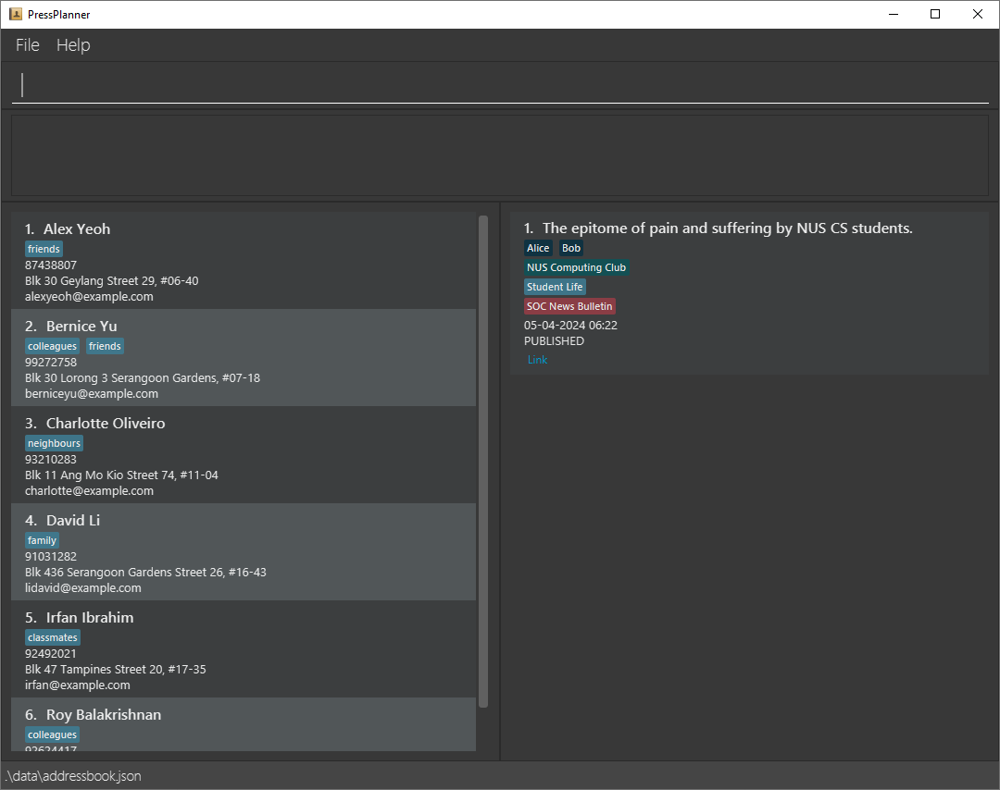

# Press Planner User Guide

## Table Of Contents

* [1. Introduction](#1-introduction)
  * [1.1. Using this Guide](#11-using-this-guide)
  * [1.2. Why Use PressPlanner](#12-why-use-pressplanner)
* [2. Getting Started](#2-getting-started)
  * [2.1. Installation](#21-installation)
  * [2.2. Launching the App](#22-launching-the-app)
  * [2.3. The Beginner's Guide to PressPlanner](#23-the-beginners-guide-to-pressplanner)
* [3. Features](#3-features)
  * [3.1. Managing Contacts](#31-managing-contacts)
    * [3.1.1. Listing All Persons](#311-listing-all-persons--list)
    * [3.1.2. Adding a Person](#312-adding-a-person--add)
    * [3.1.3. Deleting a Person](#313-deleting-a-person--delete)
    * [3.1.4. Editing a Person](#314-editing-a-person--edit)
    * [3.1.5. Searching for a Person by Name](#315-searching-for-a-person-by-name--find)
    * [3.1.6. Lookup Associated Articles](#316-lookup-associated-articles--lookup)
    * [3.1.7. Sorting Persons by Name](#317-sorting-persons-by-name--sort-n)
    * [3.1.8. Clearing All Persons](#318-clearing-all-persons--clear)
  * [3.2. Managing Articles](#32-managing-articles)
    * [3.2.1. Listing All Articles](#321-listing-all-articles--list--a)
    * [3.2.2. Adding an Article](#322-adding-an-article--add--a)
    * [3.2.3. Deleting an Article](#323-deleting-an-article--delete--a)
    * [3.2.4. Editing an Article](#324-editing-an-article--edit--a)
    * [3.2.5. Searching for an Article by Headline](#325-searching-for-an-article-by-headline--find--a)
    * [3.2.6. Filtering Articles](#326-filtering-articles--filter--a)
    * [3.2.7. Removing a Filter](#327-removing-a-filter--rmfilter--a)
    * [3.2.8. Lookup Associated Persons](#328-lookup-associated-persons--lookup--a)
    * [3.2.9. Sorting Articles by Date](#329-sorting-articles-by-date--sort--a-d)
    * [3.2.10. Opening a Webpage for an Article](#3210-opening-a-webpage-for-an-article)
  * [3.3. Other Commands](#33-other-commands)
    * [3.3.1. Viewing Help ](#331-viewing-help--help)
    * [3.3.2. Exiting PressPlanner](#332-exiting-pressplanner--exit)
* [4. Commands Quick Reference](#4-commands-quick-reference)
* [5. FAQs](#5-faqs)

## [1. Introduction](#table-of-contents)
### [1.1. Using this Guide](#1-introduction)
This guide is intended to help you get started with PressPlanner. It will guide you through the installation process, provide a brief overview of the app's features, and give you a quick reference to the commands you can use. All sections headers will link you back to the start of their parent section, so you can easily navigate the guide.
### [1.2. Why Use PressPlanner?](#1-introduction)
PressPlanner was built with **freelance journalists in mind**. It acts as your digital address book and database, helping you keep track of your contacts and articles.

Unlike major firms, freelancers often lack the same wealth of contacts and resources. PressPlanner helps you maximise the value you can get from your contacts, by providing a platform to store and manage them and keeping track of which contacts you've worked with for different articles.

PressPlanner's main features are its ability to help you:
1. Develop deeper story angles and reconnect with past interviewees or collaborators.
   - [Filter](#326-filtering-articles--filter--a) by tags to find past articles on a specific topic.
   - [Lookup](#328-lookup-associated-persons--lookup--a) persons of interest related to those past articles.
   - Contact these persons for interviews or collaboration.

2. Follow up on breaking stories
   - [Filter](#326-filtering-articles--filter--a) by status and tags to find published articles related to breaking news.
   - Make changes to your article as the story develops.

PressPlanner's tagging system for [persons](#31-managing-contacts) and [articles](#32-managing-articles) is flexible and powerful:
- Customise your use of tags and still leverage the app's search and filter functions.

## [2. Getting Started](#table-of-contents)

### [2.1. Installation](#2-getting-started)
1. Ensure that you have Java `11` or above installed on your computer.
    - Download Java 11 from [the official Oracle website](https://www.oracle.com/java/technologies/downloads/#java11).
    - If you are unsure what version of java you have, use [this guide](https://www.java.com/en/download/help/version_manual.html) to check.
1. Download the jar file from [our latest release](https://github.com/AY2324S2-CS2103T-F12-2/tp/releases).
1. Move it to an **Empty** folder.

> :warning: 
> App data will be stored in sub-folders from where it is launched. While you could run the app from any location, we recommend making a dedicated folder for our app to avoid confusion.

### [2.2. Launching the App](#2-getting-started)
1. Open a command terminal, `cd` into the folder you put the jar file in, and use the `java -jar pressplanner.jar` command to run the application.
1. A window similar to the one below should appear in a few seconds. Note how the app contains some sample data.

### [2.3. The Beginner's Guide to PressPlanner](#2-getting-started)

> :bulb:
> This section covers commands first-time users might need. For the full commands list, refer to the [Features](#3-features) section.

Let's go over the basic PressPlanner workflow. Say you've just finished interviewing a certain Gill Bates about his company's latest product. You want to save his contact for later and keep track of your article. Let's fire up PressPlanner and get this task out of the way.

1. Selecting the command box at the top of the page, let's first add Gill Bates to PressPlanner's address book list.
    - To `add` a contact we need to include the following information separated by their prefixes:
        - Name (`n/`)
        - Phone number (`p/`)
        - Email (`e/`)
        - Address (`a/`)
    - For example: `add n/Gill Bates p/12345678 e/gillbates@sicromoft.com a/Sicromoft HQ`

> :bulb:
> Adding an article uses the `add -a` command, the `-a` standing for article. The `-a` suffix is used for all commands pertaining to articles.

2. Next let's add that article you just wrote.
   - To `add -a` an article we need the following information:
       - Headline (`h/`)
       - Date (`d/`)
         - We use a single field for the date:
           - For drafts, you can use the date you started writing the article.
           - For published articles, use the date of publication.
       - Status (`s/`)
         - An article can be a `draft`, `published`, or `archived`.
     - For example: `add -a h/My Article d/20-10-2023 s/draft`

3. Now that that's done, let's say you need to find Gill Bate's number to arrange another interview.
    - Typing the command `find Gill Bates` will pull up his contact.

4. If you made a mistake or want to see all your contacts again:
    - Typing the command `list` will bring up all your contacts.

5. If you want to look up your article:
    - Typing the command `find -a My First Article` will pull up the article.

6. If you want to see all your articles again:
    - Typing the command `list -a` will bring them all up.

Now that you know the basic workflow, go ahead and try it out for yourself. If you want to learn more commands, use the `help` command in-app or refer to the [features](#3-features) section of this guide.

As you become more familiar with the app, use tags as you see fit to customise your workflow!
- Here are some ideas to get you started:
  - Using tags to rate interviewees' compliance and reliability.
  - Noting down how many clicks articles got in the first 24 hours.
  - Using tags to mark articles with potential for follow-up development.

## [3. Features](#table-of-contents)

Notes about the command format:

* Words in `UPPER_CASE` are the parameters to be supplied by you.
  e.g. in `add n/NAME`, `NAME` is a parameter which can be used as `add n/John Doe`.

* Items in square brackets are optional.

  e.g. `n/NAME [t/TAG]` can be used as `n/John Doe t/friend` or as `n/John Doe`.

* Items with `...` after them can be used multiple times. If the item is also in square brackets, it can even be used zero times.
  e.g. `[t/TAG]...` can be used as ` ` (i.e. 0 times), `t/friend`, `t/friend t/family` etc.

* Parameters can be in any order.
  e.g. if the command specifies `n/NAME p/PHONE_NUMBER`, `p/PHONE_NUMBER n/NAME` is also acceptable.

* Extraneous parameters for commands that do not take in parameters (such as `help`, `list`, `exit` and `clear`) will be ignored.
  e.g. if the command specifies `help 123`, it will be interpreted as `help`.

> :warning:
> If you are using a PDF version of this document, be careful when copying and pasting commands with line breaks as they may not paste correctly.

## [3.1. Managing Contacts](#3-features)

### [3.1.1. Listing All Persons : `list`](#31-managing-contacts)

Shows a list of all persons in PressPlanner's address book.
* Use this command to restore the full list of persons after using other commands.

Format: `list`

### [3.1.2. Adding a Person : `add`](#31-managing-contacts)

Adds a person to PressPlanner's address book.

Format: `add n/NAME p/PHONE_NUMBER e/EMAIL a/ADDRESS [t/TAG]...`

> :bulb:
> A person can have any number of tags (including 0).

Examples:
* `add n/John Doe p/98765432 e/johnd@example.com a/John street, block 123, #01-01`
* `add n/Betsy Crowe e/betsycrowe@example.com a/Apple HQ p/1234567 t/Marketing Department t/Apple`

### [3.1.3. Deleting a Person : `delete`](#31-managing-contacts)

Deletes the specified person from PressPlanner's address book.

Format: `delete INDEX`

* Deletes the person at the specified `INDEX`.
* The index refers to the index number shown in the displayed address book.
* The index **must be a positive integer** 1, 2, 3, ...

Examples:
* `list` followed by `delete 2` deletes the 2nd person in the address book.
* `find Betsy` followed by `delete 1` deletes the 1st person in the results of the `find` command.

### [3.1.4. Editing a person : `edit`](#31-managing-contacts)

Edits an existing person in PressPlanner's address book.

Format: `edit INDEX [n/NAME] [p/PHONE] [e/EMAIL] [a/ADDRESS] [t/TAG]...`

* Edits the person at the specified `INDEX`. The index refers to the index number shown in the displayed address book. The index **must be a positive integer** 1, 2, 3, ...
* At least one of the optional fields must be provided.
* Existing values will be updated to the input values.
* When editing tags, the existing tags of the person will be removed i.e. adding of tags is not cumulative.
* You can remove all the person’s tags by typing `t/` without.
  specifying any tags after it.

Examples:
*  `edit 1 p/91234567 e/johndoe@example.com` Edits the phone number and email address of the 1st person to be `91234567` and `johndoe@example.com` respectively.
*  `edit 2 n/Betsy Crowe t/` Edits the name of the 2nd person to be `Betsy Crowe` and clears all existing tags.

### [3.1.5. Searching for a Person by Name : `find`](#31-managing-contacts)

Finds persons whose names contain any of the given keywords.

Format: `find KEYWORD [MORE_KEYWORDS]`

* The search is case-insensitive. e.g. `hans` will match `Hans`.
* The order of the keywords does not matter. e.g. `Hans Bo` will match `Bo Hans`.
* Only the name is searched.
* Only full words will be matched e.g. `Han` will not match `Hans`.
* Persons matching at least one keyword will be returned (i.e. `OR` search).
  e.g. `Hans Bo` will return `Hans Gruber`, `Bo Yang`

Examples:
* `find John` returns `john` and `John Doe`
* `find alex david` returns `Alex Yeoh`, `David Li`

### [3.1.6. Lookup Associated Articles : `lookup`](#31-managing-contacts)

Display articles associated with the person where they are contributors or interviewees.

Format: `lookup INDEX`

* `INDEX` refers to the index number of the person shown in the displayed address book.
* `INDEX` **must be a positive integer** 1, 2, 3, ...
* If `INDEX` exceeds the number of persons in the displayed address book, an error message is printed.
* `INDEX` should be a positive integer, if not, an error message will be printed.
* The matching of persons to articles is based on the person's name.
    * It is case insensitive. (e.g. `John` in the address book will match `john` as an interviewee or contributor in the article).
    * It is a full word match. (e.g. `John` in the address book will not match `Johnny` or `John Doe` as an interviewee or contributor in the article).

Examples:
* `lookup 1` returns all persons associated with the first article in the list of articles.

### [3.1.7. Sorting Persons by Name : `sort n/`](#31-managing-contacts)

Sorts persons in ascending order by the lexicographical (alphabetical) ordering of their names.

Format: `sort n/`

* Executing the `sort n/` command sorts all persons in PressPlanner permanently.
  * This works differently from commands which change the current view temporarily (e.g. [find](#315-searching-person-by-name-find)).
  * Closing and reopening the app in future will result in contacts remaining sorted by name.
* Sorting is only done when the command is executed and not automatically maintained afterwards:
    * A person added using `add` after a `sort n/` command will be added to the end of the address book, regardless of their name.
    * A person edited using `edit` to change their name after a `sort n/` command will not change its position in the address book.

Example:
* `sort n/` sorts all persons in PressPlanner in ascending order by the lexicographical (alphabetical) ordering of their names.

### [3.1.8. Clearing All Persons : `clear`](#31-managing-contacts)

Clears all entries from the address book.

Format: `clear`

## [3.2. Managing Articles](#3-features)

### [3.2.1. Listing All Articles : `list -a`](#32-managing-articles)

List out all articles in PressPlanner's database.

Format: `list -a`

* No parameters necessary.
* Extra alphanumeric characters in the command (e.g. `list -ab`, `list -a1`) will be ignored and treated as `list` for persons instead.
* Extra whitespace characters in the command (e.g. `list -a `, `list -a  `) are acceptable.

### [3.2.2. Adding an Article : `add -a`](#32-managing-articles)
Adds a new article to PressPlanner's database.

Format: `add -a h/HEADLINE [c/CONTRIBUTOR... ] [i/INTERVIEWEE... ] [t/TAG... ] [o/OUTLET... ] d/DATE s/STATUS [l/LINK]`
* Only `HEADLINE`, `DATE`, and `STATUS` are mandatory fields.
  * An article's `DATE` is intended to represent:
    * Time of creation for drafts.
    * Time of publication for published articles.
  * `DATE` must be in the format `dd-mm-yyyy [HH:mm]`.
    * `HH:mm` is optional and defaults to `00:00` if not provided.
    * `HH:mm` must be in 24-hour format.
    * Examples of valid dates: `01-01-2023`, `01-01-2023 22:30`
  * `STATUS` can be `draft`, `published`, or `archived`.
* Adding an article will return to displaying all articles if a [find](#325-searching-for-an-article-by-headline--find--a) command was executed before.
  * This does not apply to [filters](#326-filtering-articles--filter--a).

Examples:
* `add -a h/iPhone 13 Review c/John Doe i/Michael Lee t/New Releases d/20-03-2024 s/draft`
* `add -a h/AI Inc. Acquired by Google c/Alex Johnson i/Emily Brown t/AI o/CNA d/30-08-2024 08:45 s/published l/www.example.com`

### [3.2.3. Deleting an Article : `delete -a`](#32-managing-articles)

Deletes an existing article from PressPlanner's database.

Format : `delete -a INDEX`

* Deletes the article at the specified `INDEX`.
  * The `INDEX` refers to the index number shown in the current article list view.
    * If a `filter`, `sort` or `find` command was executed before, the index refers to the index number shown in the filtered/sorted list of articles.
    * e.g. `delete 1` after the `find` command deletes the first article found by the `find` command.
* If `INDEX` exceeds the number of articles in the list, an error message is printed.
* `INDEX` should be a positive integer, if not, an error message will be printed.

Example : `delete -a 1` deletes the article at the first index.

### [3.2.4. Editing an Article : `edit -a`](#32-managing-articles)

Edits an existing article in PressPlanner's database.

Format: `edit -a [h/HEADLINE] [d/DATE] [s/STATUS] [c/CONTRIBUTOR... ] [i/INTERVIEWEE... ] [t/TAG... ] [o/OUTLET... ] [l/LINK]`

* Edits the article at the specified `INDEX`.
  * The `INDEX` refers to the index number shown in the current article list view.
  * If a `filter`, `sort` or `find` command was executed before, the index refers to the index number shown in the filtered/sorted list of articles.
* At least one of the optional fields must be provided.
* Existing values will be updated to the input values.
  * When editing a field, the original values will be overwritten by the new values.
    * `t/` without any value after it will clear all existing tags.
    * `c/new contributor` will replace all existing contributors with `new contributor`.
* Refer to the [add article](#322-adding-an-article--add--a) command for the format of each field.
* Editing an article will return to displaying all articles if a [find](#325-searching-for-an-article-by-headline--find--a) command was executed before.
  * This does not apply to [filters](#326-filtering-articles--filter--a).

Examples:
*  `edit 1 h/iPhone Review` Edits the headline of the 1st article to be `iPhone Review`.
*  `edit 2 h/iPhone Review i/` Edits the headline of the 2nd article to be `iPhone Review` and clears all existing interviewees.

### [3.2.5. Searching for an Article by Headline : `find -a`](#32-managing-articles)

Finds articles with headlines containing any of the given keywords.

Format: `find -a KEYWORD [MORE_KEYWORDS]`

* Only the headline is searched for matches.
* The search is case-insensitive.
  * e.g `iphone` will match `iPhone`
* The order of the keywords does not matter.
    * e.g. `Pro Vision` will match `Vision Pro`
* Only full words will be matched.
  * e.g. `iPhone` will not match `iPhones`
* Articles matching at least one keyword will be returned.
  * e.g. `find -a Vision Pro` will return an article with the headline: `Pro tips for Windows 10 Users`

Examples:
* `find -a Vision Pro` returns articles with headlines containing `Vision` or `Pro`.

### [3.2.6. Filtering Articles : `filter -a`](#32-managing-articles)
Filter PressPlanner's database by a combination of attributes to find articles you are looking for quickly.

Format: `filter -a s/STATUS t/TAG ST/START_DATE EN/END_DATE`
* All the prefixes need to be included, but can be left blank.
  * e.g. `filter -a s/ t/ st/ en/` is a valid command
  * e.g. `filter -a s/ t/ st/` is not a valid command
  * Leaving `st/` or `en/` blank defaults to the earliest or latest date possible respectively.
* Use the `filter` command **prior to a `find` command**.
  * `filter` will list all matching articles within the database when first applied.
  * `find` can be used to then search the filtered list.
    * Using `filter` after a `find` command will overwrite the previous `find` command.
* Filters are not stored between sessions, so make sure to finish your search before closing the app!
* Filters will apply until you [remove](#327-removing-a-filter--rmfilter--a) it or apply a new filter, so make sure you [remove](#327-removing-a-filter--rmfilter--a) it after you are done!
* Refer to the [add article](#322-adding-an-article--add--a) command for the format of each field.
  * Note that `START_DATE` and `END_DATE` must be in the same format as `DATE` in the [add article](#322-adding-an-article--add--a) command.

Examples:
* `filter -a s/draft t/ st/ en/` will restrict the display to showing only articles with draft status.

### [3.2.7. Removing a Filter : `rmfilter -a`](#32-managing-articles)
Remove all filters so that all articles in PressPlanner's database are displayed.

Format: `rmfilter -a`

* No additional parameters.
* The `-a` is necessary, additional letters will cause the command to fail.

### [3.2.8. Lookup Associated Persons : `lookup -a`](#32-managing-articles)

Finds persons associated with an article as interviewees or contributors.

Format: `lookup -a INDEX`

* `INDEX` refers to the index number shown in the displayed article database.
* `INDEX` **must be a positive integer** 1, 2, 3, ...
* If `INDEX` exceeds the number of articles in the displayed database, an error message is printed.
* `INDEX` should be a positive integer, if not, an error message will be printed.
* The matching of articles to persons is based on the person's name.
    * It is case insensitive. (e.g. `john` as an interviewee or contributor in the article will match `John` in the address book).
    * It is a full word match. (e.g. `John` as an interviewee or contributor in the article will not match `Johnny` or `John Doe` in the address book).
  
Examples:
* `lookup -a 1` returns all persons associated with the first article in the list of articles.

### [3.2.9. Sorting Articles by Date : `sort -a d/`](#32-managing-articles)

Sorts articles in PressPlanner's database in descending order by their date and time.

Format: `sort -a d/`

* Executing the `sort -a d/` command sorts all articles in PressPlanner permanently.
    * This works differently from commands which change the current view (e.g. [find](#325-searching-for-an-article-by-headline--find--a), [lookup](#328-lookup-associated-persons--lookup--a) or [filter](#326-filtering-articles--filter--a)).
    * Closing and reopening the app in future will result in articles remaining sorted by date.
* Sorting is only done when the command is executed and not automatically maintained afterwards:
  * An article added using `add -a` after a `sort -a d/` command will be added to the end of the list, regardless of its date.
  * An article edited using `edit -a` to change the date after a `sort -a d/` command will not change its position in the list.

Example:
* `sort -a d/` sorts all articles in PressPlanner in descending order by their date and time.

### [3.2.10. Opening a Webpage for an Article](#32-managing-articles)

* By clicking the `Link` button of your article that is highlighted in yellow box in the picture below, you can open up the webpage for your article that is added when you added the article.

## [3.3. Other Commands](#3-features)

### [3.3.1. Viewing Help : `help`](#33-other-commands)

Shows a message explaining how to access the help page.

Format: `help`

### [3.3.2. Exiting PressPlanner : `exit`](#33-other-commands)

Exits the program.

Format: `exit`

## [4. Commands Quick Reference](#table-of-contents)
| Action                     | Command Format                                                                                                         | Example                                                                                                                        |
|----------------------------|------------------------------------------------------------------------------------------------------------------------|--------------------------------------------------------------------------------------------------------------------------------|
| List Persons               | `list`                                                                                                                 | `list`                                                                                                                         |
| Add Person                 | `add n/NAME p/PHONE_NUMBER e/EMAIL a/ADDRESS [t/TAG]...`                                                               | `add n/Betsy Crowe p/1234567 e/betsycrowe@example.com a/Apple HQ  t/Marketing Department t/Apple`                              |
| Delete Person              | `delete INDEX`                                                                                                         | `delete 3`                                                                                                                     |
| Edit Person                | `edit INDEX [n/NAME] [p/PHONE_NUMBER] [e/EMAIL] [a/ADDRESS] [t/TAG]...`                                                | `edit 2 n/Betsy Crowe e/betsycrowe@example.com`                                                                                |
| Find Person                | `find KEYWORD [MORE_KEYWORDS]`                                                                                         | `find Crowe Betsy`                                                                                                             |
| Lookup Associated Articles | `lookup INDEX`                                                                                                         | `lookup 1`                                                                                                                     |
| Sort Persons by Name       | `sort n/`                                                                                                              | `sort n/`                                                                                                                      |
| Clear Persons              | `clear`                                                                                                                | `clear`                                                                                                                        |
| List Article               | `list -a`                                                                                                              | `list -a`                                                                                                                      |
| Add Article                | `add -a h/HEADLINE [c/CONTRIBUTOR... ] [i/INTERVIEWEE... ] [t/TAG... ] [o/OUTLET... ] d/DATE s/STATUS [l/LINK]`        | `add -a h/AI Inc. Acquired by Google c/Alex Johnson i/Emily Brown t/AI o/CNA d/30-08-2024 08:45 s/published l/www.example.com` |
| Delete Article             | `delete -a [INDEX]`                                                                                                    | `delete -a 1`                                                                                                                  |
| Edit Article               | `edit -a [h/HEADLINE] [d/DATE] [s/STATUS] [c/CONTRIBUTOR... ] [i/INTERVIEWEE... ] [t/TAG... ] [o/OUTLET... ] [l/LINK]` | `edit 2 h/iPhone Review i/`                                                                                                    |
| Find Article               | `find -a KEYWORD [MORE_KEYWORDS]`                                                                                      | `find -a Vision Pro`                                                                                                           |
| Filter Articles            | `filter -a s/STATUS t/TAG ST/START_DATE EN/END_DATE `                                                                  | `filter -a s/draft t/Apple st/01-01-2024 en/`                                                                                  |
| Remove Filter              | `rmfilter -a`                                                                                                          | `rmfilter -a`                                                                                                                  |
| Lookup Associated People   | `lookup -a INDEX`                                                                                                      | `lookup -a 1`                                                                                                                  |
| Sort Articles              | `sort -a d/`                                                                                                           | `sort -a d/`                                                                                                                   |
| Help                       | `help`                                                                                                                 | `help`                                                                                                                         |
| Exit                       | `exit`                                                                                                                 | `exit`                                                                                                                         | 

## [5. FAQs](#table-of-contents)
### [5.1. Why am I unable to run PressPlanner on my desktop?](#5-faqs)
* Please check that you have downloaded Version 11 Java SDK that suits your computer’s operating system (Windows, MacOS, Linux).
* If you are unsure of whether you have done so, please navigate back to the “Getting Started” Segment of the User Guide to access the link which will bring you to the Java Oracle Website where you can re-download the Version 11 Java SDK for your operating system.

### [5.2. How do I ensure that I have saved all the contacts and articles I have added in this session?](#5-faqs)
* Do not worry about issues regarding the saving of data you have entered into the application, they are saved into files automatically upon the execution of every command which modifies or adds new data.

### [5.3. Why were all my previous data for contacts (and / or) articles from previous sessions deleted and replaced by the default template data?](#5-faqs)
* This means that your save file was either corrupted or lost. To avoid this, refrain from editing files in the data folder (specifically **AddressBook.json** and **ArticleBook.json** files which contain the saved contacts and articles respectively, from previous sessions) unless you are sure about what you are doing.
* To mitigate possible accidental data corruption which may result in the deletion of any of the save files, please make a copy of the data files after every session where major changes were made, so that in the event the most recent data is lost, you would still have a recent data file which can then be added back into the data folder located at the working directory of the PressPlanner.jar file and be loaded up into the application.

### [5.4. Why does my link not open the browser?](#5-faqs)
* This means that your URL added to the PressPlanner is an invalid link.
* To let you know when the URL is invalid, we will soon be implementing the app to show you an error message when your link that is typed is invalid. Please wait for our future updates!
